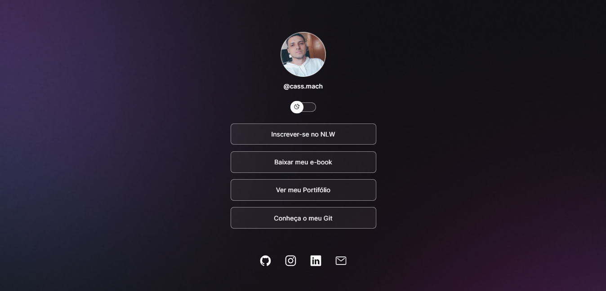

<h1 align="center"> Projeto DevLinks </h1>

Evento exclusivo e gratuito, promovido pela Rocketseat para ensino de tecnologias WEB.
 
Veja ele aqui > https://cassmach.github.io/projeto-devlink/

  <a href="#-tecnologias">Tecnologias</a>&nbsp;&nbsp;&nbsp;|&nbsp;&nbsp;&nbsp;
  <a href="#-projeto">Projeto</a>&nbsp;&nbsp;&nbsp;|&nbsp;&nbsp;&nbsp;
  <a href="#-layout">Layout</a>&nbsp;&nbsp;&nbsp;|&nbsp;&nbsp;&nbsp;
  <a href="#memo-licença">Licença</a>

  

 

## 🚀 Tecnologias

Esse projeto foi desenvolvido com as seguintes tecnologias:

- HTML e CSS
- JavaScript
- Git e Github
-Figma

## 💻 Projeto

O devLinks é um agregador de links para usar como cartão de visitas online.

## 🔖 Layout

Você pode visualizar o layout do projeto através [DESSE LINK](https://www.figma.com/file/ZreKBoZqAW8PmWj9dKMuP7/DevLinks-%E2%80%A2-Projeto-Discover-(Community)?type=design&node-id=10%3A620&mode=design&t=KGKHq63iTajPKLQs-1). É necessário ter conta no [Figma](https://figma.com) para acessá-lo.

## :memo: Licença

Esse projeto está sob a licença MIT.

---

Feito com ♥ by Cássio Machado.
